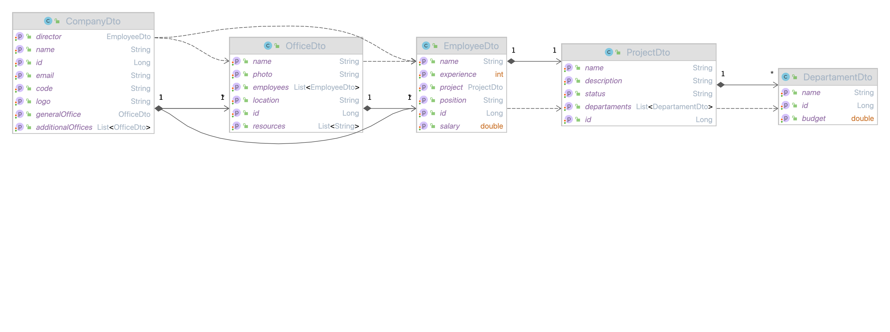

# Benchmark Template Engines

Проект для аналитики библиотек шаблонизаторов на JVM языках

| ЯП     | Версия  |
|--------|---------|
| Java   | 17      |
| Kotlin | 1.8.0   |
| Scala  | 2.13.16 |

## Тестируемые библиотеки

| Название      | Версия                    | Ссылка на GitHub                                            |
|---------------|---------------------------|-------------------------------------------------------------|
| FreeMarker    | 2.3.23                    | [🔗 GitHub](https://github.com/apache/freemarker)           |
| Thymeleaf     | 3.1.0.RELEASE             | [🔗 GitHub](https://github.com/thymeleaf/thymeleaf)         |
| Pebble        | 3.2.2                     | [🔗 GitHub](https://github.com/PebbleTemplates/pebble)      |
| Mustache      | 0.9.10                    | [🔗 GitHub](https://github.com/spullara/mustache.java)      |
| Fizzed        | 2.1.0                     | [🔗 GitHub](https://github.com/fizzed/rocker)               |
| Trimou        | 2.5.0.Final               | [🔗 GitHub](https://github.com/trimou/trimou)               |
| Velocity      | 1.7                       | [🔗 GitHub](https://github.com/apache/velocity-engine)      |
| Liqp          | 0.9.1.3                   | [🔗 GitHub](https://github.com/bkiers/Liqp)                 |
| HTTL          | 1.0.11                    | [🔗 GitHub](https://github.com/httl/httl)                   |
| Jinjava       | 2.7.4                     | [🔗 GitHub](https://github.com/HubSpot/jinjava)             |
| XDocReport    | 2.1.0                     | [🔗 GitHub](https://github.com/opensagres/xdocreport)       |
| YARG          | 2.2.14                    | [🔗 GitHub](https://github.com/cuba-platform/yarg)          |
| JasperReports | 6.7.0                     | [🔗 GitHub](https://github.com/TIBCOSoftware/jasperreports) |
| Docx-Stamper  | 2.5.0                     | [🔗 GitHub](https://github.com/thombergs/docx-stamper)      |
| BIRT          | 4.4.1                     | [🔗 GitHub](https://github.com/eclipse/birt)                |
| Handlebars    | 4.4.0                     | [🔗 GitHub](https://github.com/jknack/handlebars.java)      |
| Barber        | 2024.01.12.173005-933c241 | [🔗 GitHub](https://github.com/cashapp/barber)              |
| Scalate       | 1.10.1                    | [🔗 GitHub](https://github.com/scalate/scalate)             |

## Структура проекта 

```html
├── /benchmark                          # Модуль нагрузочного тестирования
│   ├── /src
│   │	├── /main                       # Исходники тестируемых компонентов
│   │	│   ├── /java                   # Библиотеки на JAVA
│   │   │   │   └── ru.sbertech.platformv.print.benchmark.templateengine
│   │	│   ├── /kotlin                 # Библиотеки на Kotlin
│   │   │   │   └── ru.sbertech.platformv.print.benchmark.kotlin.templateengine
│   │	│   └── /scala                  # Библиотеки на Scala
│   │   │       └── ru.sbertech.platformv.print.benchmark.scala.templateengine
│   │   │           ├── /engine         
│   │   │           ├── /mapper
│   │   │           └── /model
│   │   ├── /test                       # Unit тестирование с использованием StopWatch
│   │   │    └── /java
│   │   │        └── ru.sbertech.platformv.print.benchmark.templateengine
│   │   └── /resources
│   │       ├── /db/changelog           # Миграции БД
│   │       ├── /templates              # Исходники шаблонов
│   │       ├── application.yaml        # Конфигурация ресурсов
│   │       ├── httl.properties
│   │       └── logback.xml             # Настройка Log4J с отключением профилей логирования
│   └── pom.xml                         # Импорт исходников шаблонизаторов
├── /model                              # Модуль предметной модели
│   ├── /src
│   │	├── /main
│   │	│   └──  /java
│   │   │       └── ru.sbertech.platformv.print.benchmark.domain
│   │   │           ├── /configuration
│   │   │           ├── /mapper
│   │   │           ├── /repository
│   │   │           └── /service
│   │   └── /resources                  # Настройка авто-конфигурации
│   │        └── /META-INF
│   │            ├── /spring
│   │            │   └── org.springframework.boot.autoconfigure.AutoConfiguration.imports
│   │            └── spring.factories
│   └── pom.xml                         # Проект, отвечающий за сборку компонентов Spring приложения
└── pom.xml                             # Корневой проект, содержащий версии используемых языков и библиотек
```

## Описание предметной задачи

### Тестовые данные

Тестирование движков происходило условной модели группы компаний с набором офисов.


Для всех движков использовался одинаковый шаблон со структурой:
- Список компаний
  - Информация о компании 
  - Название 
  - Директор 
  - Центральный офис 
  - Инд. код 
  - Логотип 
  - Список дополнительных офисов 
    - Информации о офисе 
    - Название 
    - Адрес 
    - Доступные ресурсы 
    - Фотография 
    - Список сотрудников офиса 
      - Табельный номер 
      - Имя 
      - Должность 
      - Проект 
      - Стаж 
      - Зарплата
  
### Примеры реализованных шаблонов

[Преобразованный шаблон в PDF](./docs/OfficesReport.pdf)  
[ODT шаблон](./docs/ReportCompanies.odt)


## Список улучшений

- Использование Clogure и Groovy библиотек